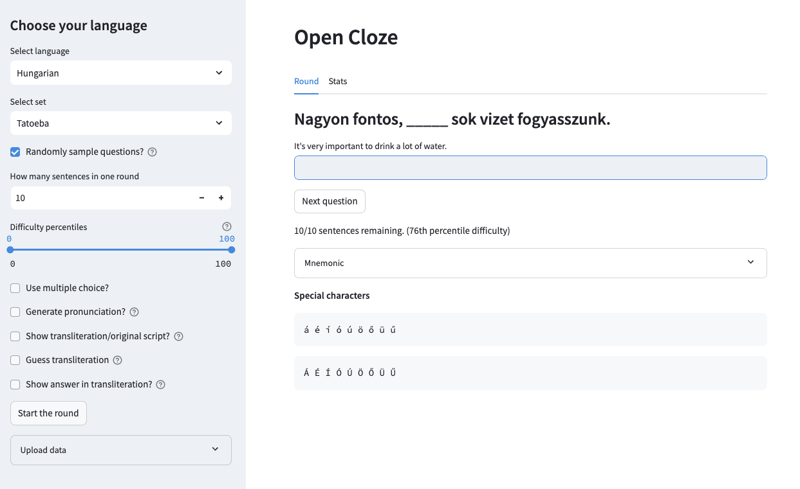

# open_cloze
This application provides a front end for practicing cloze tests. It supports any language listed on [https://www.manythings.org/anki/](https://www.manythings.org/anki/) and you can add your own sentence pairs as well. If you do one-word sentences its functionality is equivalent to that of a flashcard app. You can try it for free at [https://open-cloze.streamlit.app/](https://open-cloze.streamlit.app/) with user User and password password, though individual progress won't be saved unless you self-host.

## Installation
- Install the libraries in requirements.txt
- Clone this repo
- Edit .streamlit/secrets.toml to set the password for your page
- Edit the metadata.csv file to add additional users and languages to your application.
- To add a new language, add a new row to the metadata.csv file with the name of the language, any special characters it may have (optional), its three-letter abbreviation on [https://www.manythings.org/anki/](https://www.manythings.org/anki/), and its two-letter Google Translate abbreviation.
- Run the application by navigating to the directory where you cloned the repository and running streamlit run app.py. This should open a browser window to the application. Progress is saved on a user-level in the database/ directory.

## Functionality
### Overview
The application gives presents you with a sentence in your learning language with a word missing and the English translation. You try to fill in the missing word. The initial sentence list comes from [https://www.manythings.org/anki/](https://www.manythings.org/anki/), but you can add your own sentences. If you add one-word sentence pairs, it's analogous to a flashcard app.

### Select set
You can have more than one sentence set per language, which you can select via the `Select set` dropdown. The default one loaded from manythings.org is the `Tatoeba` set, which includes a large sample of sentences per language. If you add more of your own later, they will appear in the dropdown.

### Types of rounds
In the sidebar, check `Randomly sampled questions?` to practice a certain amount of randomly selected sentences in a round. You can decide how many to practice in a single round via the `How many sentences in one round` field.

The `Difficulty percentiles` slider lets you choose if you want to practice easier or harder sentences. The lower the percentile, the easier the sentences.

If you uncheck `Randomly sampled questions?`, the sentences will be presented to you in order. You can use `Sentence number start` and `Sentence number start` end to dictate which sentences you want to practice. This is useful if for instance you input an article you want to practice and read and want the sentences provided in order.

### Round options
- `Use multiple choice?`: whether to use multiple choice or direct text input. If you choose multiple choice, you can choose how many options to be given.
- `How many missing words in the cloze sentence`: how many blank spaces you want to have to guess in the sentence.
- `Generate pronuncation?`: whether or not to produce audio of the sentences being read aloud.
- `Show transliteration/original script?`: if the language isn't written in the latin script, whether or not to also show the transliteration. Automatic transliteration is currently available for Arabic, Russian, Greek, Hindi, Bengali, Japanese, and Mandarin.
- `Guess transliteration?`: you can guess the transliteration rather than the original script if that is easier for you.
- `Show answer in transliteration?`: if showing transliteration, whether or not to show the answer in the transliteration.

### Mnemonics
During a round, click the `Mnemonic` dropdown to view and record mnemonics for a sentence/term to help you remember it. These will be saved and displayed across rounds.

### Stats
The `Stats` tab shows you various statistics of your usage. It shows you a progress bar of how many of the sentences in the selected set you have already studied.

Change the date range to view statistics for different periods of time. Change the time aggregation to get your stats by day, week, month, or year.

- `Number of sentences studied`: this plot shows the number of sentences/terms studied over a given period of time
- `Minutes spent studying`: this plot shows the number of minutes spent studying over a given period of time
- `Set progress over time`: this plot shows the percentage of the set completed over time
- `Wrong/right ratio`: this plot shows the ratio between the number of wrong answer to right answers over a given period of time. E.g., a ratio of 0 means that you got every answer right on your first try, a ratio of 2 means that you made two mistakes for every correct answer you entered.

### Uploading your own data
In addition to the sentence lists from manythings.org, you can upload your own. You have three options for uploading via the `Upload data` dropdown in the sidebar:

1. upload a CSV with an `english` and a `translation` column. You can include an additional column called `missing_indices` with a comma separated list of numbers specifying which word should be the cloze word. E.g., if the translation is `mi nombre es Tom`, you can put `1,3,4` in the  `missing_indices` column. Which means if one missing word is selected `mi` will be the missing word, if two is selected, `mi` and `es` will be the missing words, etc.
2. upload a .txt file with raw text of the learning language. This file will automatically be split into sentences and translated with Google Translate.
3. Similar to 2., you can paste the text you want to convert to a study set directly into the `Paste text directly` box

When uploading your own data, put the name you want the set to have in the `Set name of uploaded data` text field.

You can delete unwanted sets from a language by putting the set's name in the `Set name of uploaded data` field and pressing the `Delete set from database` button.

## Sample image
